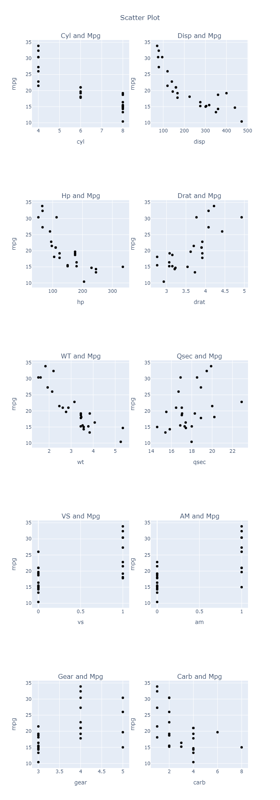
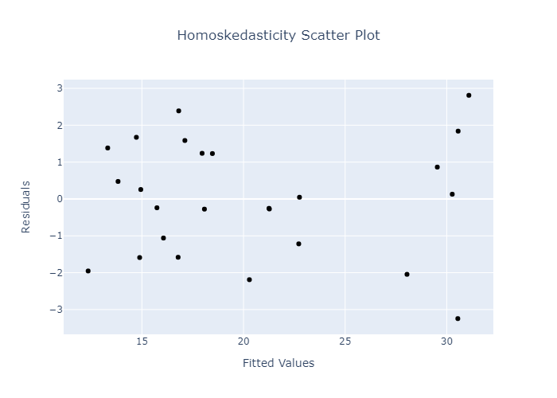

Halo semua. Pada kesempatan kali ini, saya akan mencoba menganalisis salah satu dataset yang ada di R, yaitu `mtcars`, tetapi menggunakan Python. Ini adalah hasil analisis data saya pertama kali (di luar perkuliahan) yang saya publikasikan. Saya hanya ingin membagikan ilmu yang sudah saya pelajari selama ini kepada teman-teman semua yang ingin belajar menganalisis data. Tentunya saya juga bisa belajar dari teman-teman yang lebih expert di bidang analisis data melalui komentar yang nantinya teman-teman berikan. 

Di sini, saya akan menyelidiki apa saja yang mempengaruhi penggunaan bahan bakar (mpg) dari sebuah mobil. Beberapa variabel yang ada di dataset `mtcars` ini adalah
```
mpg  : miles per galoon
cyl  : number of cylinders
disp : displacement
hp   : gross horsepower
drat : rear axle ratio
wt   : weight (1000 lbs)
qsec : 1/4 mile time
vs   : engine (0 = V-shaped, 1 = straight)
am   : transmission (0 = automatic, 1 = manual)
gear : number of forward gears
carb : Number of carburetors
```
Untuk selanjutnya, mpg akan saya sebut sebagai variabel dependen sedangkan sisanya saya sebut sebagai variabel independen.

Saya akan menggunakan analisis regresi linear sederhana. Tentunya bagaimana menganalisis data tiap orang berbeda, tetapi saya menggunakan analisis ini karena analisis ini lebih mudah. Untuk dataset `mtcars` bisa teman-teman lihat [di sini](https://github.com/Rangga1708/Motor_Trend_US_Analysis/blob/master/mtcars.xlsx) dan untuk syntax yang saya buat dapat dilihat [di sini](https://github.com/Rangga1708/motor-trend-US-analysis/blob/master/Syntax%20Analisis%20Data%20Motor%20Trend%20US.ipynb). 

Pertama saya akan mengimport beberapa modules python yang saya butuhkan. Modules yang akan saya gunakan adalah sebagai berikut:
```Python
import pandas as pd
import plotly.graph_objs as go
from plotly.subplots import make_subplots
import statsmodels.api as sm
from statsmodels.stats.outliers_influence import variance_inflation_factor
from statsmodels.sandbox.stats.runs import runstest_1samp
from sklearn.model_selection import train_test_split
from scipy.stats import shapiro
```

## Data Train dan Data Test
Sebagai tahapan awal, saya akan membagi datanya menjadi 2, yaitu data train dan data test. Data train akan saya gunakan untuk membentuk model sedangkan data test akan saya gunakan untuk menguji model yang sudah terbentuk. Dari keseluruhan data, saya akan pilih 80% data secara acak sebagai data train, dan 20% data secara acak sebagai data test.
```Python
#input data
df = pd.read_excel ('mtcars.xlsx')

#bagi antara variabel independen dengan variabel dependen
X = df[['cyl','disp','hp','drat','wt','qsec','vs','am','gear','carb']]
Y = df['mpg']

#bagi data menjadi train dan test
X_train, X_test, Y_train, Y_test = train_test_split(X, Y, test_size=0.2)

#reset index
X_train = X_train.reset_index(drop = True)
X_test = X_test.reset_index(drop = True)
Y_train = Y_train.reset_index(drop = True)
Y_test = Y_test.reset_index(drop = True)

#menamai ulang variabel
X = X_train
Y = Y_train
```
Data train dan data test yang saya gunakan dapat teman-teman lihat [di sini](https://github.com/Rangga1708/Motor_Trend_US_Analysis/blob/master/data_train.xlsx) dan [di sini](https://github.com/Rangga1708/Motor_Trend_US_Analysis/blob/master/data_test.xlsx).

## Asumsi awal
Setelah membagi datanya, selanjutnya akan selidiki beberapa asumsi awal analisis regresi linear. Asumsi yang akan diselidiki adalah
1. Cek apakah ada hubungan linear antara linearitas dari variabel dependen dengan variabel independen. (***Linearitas***)
2. Cek apakah setiap variabel independen saling mempengaruhi satu sama lain. (***Multikolinearitas***)

### Linearitas
Pertama saya akan mengecek apakah terdapat hubungan linear antara variabel dependen dengan variabel independen lainnya. Untuk menyelidikinya, kita bisa melihatnya dari scatter plot di bawah ini.
```Python
#siapkan figure subplot
fig = make_subplots(
    rows = 5, cols = 2,
    subplot_titles = ("Cyl and Mpg", 
                      "Disp and Mpg", 
                      "Hp and Mpg", 
                      "Drat and Mpg", 
                      "WT and Mpg",
                      "Qsec and Mpg", 
                      "VS and Mpg", 
                      "AM and Mpg", 
                      "Gear and Mpg", 
                      "Carb and Mpg")
)

#buat plot masing-masing subplot
index = 0
for i in range(1,6):
    for j in range(1,3):
        fig.add_trace(go.Scatter(x = X[X.keys()[index]], y = Y, mode = 'markers', marker = {'color' : 'black'}), row = i, col = j)
        fig.update_xaxes(title_text = X.keys()[index], row = i, col = j)
        fig.update_yaxes(title_text = 'mpg', row = i, col = j)
        index = index+1

#atur layout        
layout = {
    'height' : 2000,
    #'width' : 1000,
    'title' : {
        'text' : 'Scatter Plot',
        'x' : 0.5
    },
    'showlegend' : False
}

fig.update_layout(layout)

fig.show()
```



Berdasarkan scatter plot di atas, tampak bahwa terdapat hubungan linear antara beberapa variabel independen dengan variabel mpg. Kita dapat simpulkan beberapa hal sebagai berikut:
1. Terdapat hubungan linear negatif antara variabel cyl dan mpg. Artinya, semakin banyak silinder pada mobil, semakin sedikit bahan bakar yang terpakai.
2. Terdapat hubungan linear negatif antara variabel disp dan mpg. Artinya, semakin besar displacement pada mobil, semakin sedikit bahan bakar yang terpakai.
3. Terdapat hubungan linear negatif antara variabel hp dan mpg. Artinya, semakin besar horsepower mobil, semakin sedikit bahan bakar yang terpakai.
4. Terdapat hubungan linear positif antara variabel drat dan mpg. Artinya, semakin besar rear axle gear ratio pada mobil, semakin banyak bahan bakar yang terpakai.
5. Terdapat hubungan linear negatif antara variabel wt dan mpg. Artinya, semakin berat mobil, semakin sedikit bahan bakar yang terpakai.
6. Terdapat hubungan linear positif antara variabel qsec dan mpg. Artinya, semakin lama mobil menempuh jarak 1/4 mil , semakin banyak bahan bakar yang terpakai.
7. Konfigurasi silinder yang berbentuk V akan memakai bahan bakar lebih sedikit dibandingkan dengan konfigurasi silinder yang berbentuk garis lurus.
8. Mobil matic akan memakai bahan bakar lebih sedikit dibandingkan dengan mobil manual.
9. Mobil dengan 3 gigi akan memakai bahan bakar lebih sedikit dibandingkan dengan mobil dengan 5 gigi dibandingkan dengan mobil dengan 4 gigi.
10. Terdapat hubungan linear negatif antara variabel carb dan mpg. Artinya, semakin banyak karburator pada mobil, semakin sedikit bahan bakar yang terpakai.

Sekilas mungkin untuk variabel gear tidak memiliki hubungan linear dengan mpg. Tapi kita asumsikan variabel gear memiliki hubungan linear dengan mpg.

## Multikolinearitas
Selanjutnya, kita akan menyelidiki apakah variabel-variabel independen pada data kita saling mempengaruhi atau tidak. Kita akan mengecek nilai VIF dari masing-masing variabel. Jika VIF > 10, maka variabel tersebut memiliki hubungan dengan variabel independen lainnya. Kita akan membuang variabel dengan VIF terbesar kemudian kita akan cek kembali VIF variabel-variabel yang tersisa (Konstanta akan tetap dipertahankan). Kita akan ulangi terus sampai kita peroleh VIF dari semua variabel kurang dari 10. Berikut rangkuman nilai VIF dari setiap iterasi.
```Python
X = sm.add_constant(X)

#hitung VIF
VIF = pd.Series([variance_inflation_factor(X.values, i) 
               for i in range(X.shape[1])], 
              index=X.columns)
print(VIF,'\n')

#jika VIF konstanta terbesar, cari terbesar kedua
if list(VIF).index(max(VIF)) == 0:    
    new_VIF = VIF[1:]
    drop_variable_VIF = max(new_VIF)

while drop_variable_VIF > 10 and len(X.keys())!=0:
    #buang variabel dengan VIF terbesar dan lebih dari 10
    drop_variable_index = list(VIF).index(drop_variable_VIF)                          
    drop_variable = X.keys()[drop_variable_index]
    X = X.drop(columns = drop_variable) 
    
    VIF = pd.Series([variance_inflation_factor(X.values, i) 
               for i in range(X.shape[1])], 
              index=X.columns)
    print(VIF,'\n')
    
    #jika VIF konstanta terbesar, cari terbesar kedua
    if list(VIF).index(max(VIF)) == 0:    
        new_VIF = VIF[1:]
        drop_variable_VIF = max(new_VIF)
```
Berikut rangkuman dari nilai VIF setiap iterasi.
<table>
    <tr>
        <th>Iterasi</th>
        <th>Variabel</th>
        <th>VIF</th>
    </tr>
    <tr>
        <td rowspan="11">1</td>
        <td>const</td>
        <td>2149.280570</td>
    </tr>
    <tr>    <td>	cyl     </td> <td> 19.691673	</td>	</tr>
    <tr>	<td>	disp    </td> <td> 22.176578	</td>	</tr>
    <tr>	<td>	hp      </td> <td> 10.308235	</td>	</tr>
    <tr>	<td>	drat    </td> <td> 4.114787	    </td>	</tr>
    <tr>	<td>	wt      </td> <td> 17.319301	</td>	</tr>
    <tr>	<td>	qsec    </td> <td> 7.284777	    </td>	</tr>
    <tr>	<td>	vs      </td> <td> 4.702383	    </td>	</tr>
    <tr>	<td>	am      </td> <td> 5.234086	    </td>	</tr>
    <tr>	<td>	gear    </td> <td> 7.002498	    </td>	</tr>
    <tr>	<td>	carb    </td> <td> 11.759377	</td>	</tr>
    <tr>
        <td rowspan="10">2</td>
        <td>const</td>
        <td>2149.201123</td>
    </tr>
    <tr>	<td>	cyl     </td> <td> 18.589723	</td>	</tr>
    <tr>	<td>	hp      </td> <td> 6.615471	    </td>	</tr>
    <tr>	<td>	drat    </td> <td> 4.024375	    </td>	</tr>
    <tr>	<td>	wt      </td> <td> 8.076653	    </td>	</tr>
    <tr>	<td>	qsec    </td> <td> 6.744210	    </td>	</tr>
    <tr>	<td>	vs      </td> <td> 4.654625	    </td>	</tr>
    <tr>	<td>	am      </td> <td> 5.176873	    </td>	</tr>
    <tr>	<td>	gear    </td> <td> 7.000588	    </td>	</tr>
    <tr>	<td>	carb    </td> <td> 7.077009	    </td>	</tr>
    <tr>
        <td rowspan="10">3</td>
        <td>const</td>
        <td>736.258880</td>
    </tr>
    <tr>	<td>	hp      </td> <td> 6.553351	</td>	</tr>
    <tr>	<td>	drat    </td> <td> 3.142362	</td>	</tr>
    <tr>	<td>	wt      </td> <td> 7.695028	</td>	</tr>
    <tr>	<td>	qsec    </td> <td> 5.254881	</td>	</tr>
    <tr>	<td>	vs      </td> <td> 4.291331	</td>	</tr>
    <tr>	<td>	am      </td> <td> 4.951499	</td>	</tr>
    <tr>	<td>	gear    </td> <td> 5.176046	</td>	</tr>
    <tr>	<td>	carb    </td> <td> 6.275307	</td>	</tr>
</table>

Dari hasil perhitungan di atas, dapat kita lihat bahwa ternyata nilai dari cyl dan disp dipengaruhi oleh variabel independen lainnya. Dengan demikian, kita perlu membuang variabel tersebut agar analisis regresi dapat dilakukan. 

## Variable Selection
Selanjutnya, untuk memilih variabel apa saja yang signifikan terhadap model, kita akan menggunakan stepwise regression, khususnya backward elimination. Pertama, kita akan membentuk model menggunakan semua variabel. Kemudian kita akan lihat apakah ada variabel yang tidak signifikan (jika p-value lebih dari ). Jika ada variabel yang tidak signifikan, kita keluarkan variabel tersebut (terutama yang p-value nya terbesar) kemudian kita bentuk model yang baru. Langkah ini diteruskan sampai semua variabel signifikan terhadap model.
```Python
model = []
loglikelihood = []
model.append(sm.OLS(Y,X).fit())

i = 0
variables_pvalue = list(model[i].pvalues)
loglikelihood.append(sm.OLS(Y,X).loglike(model[i].params))

while max(variables_pvalue) > 0.05 and len(X.keys())!=0:
    #buang variabel yang tidak signifikan
    drop_variable_pvalue = max(variables_pvalue)
    drop_variable_index = variables_pvalue.index(drop_variable_pvalue)                          
    drop_variable = X.keys()[drop_variable_index]
    X = X.drop(columns = drop_variable) 
    
    model.append(sm.OLS(Y,X).fit())

    i = i+1
    variables_pvalue = list(model[i].pvalues)
    loglikelihood.append(sm.OLS(Y,X).loglike(model[i].params))

for i in model:
    print(i.summary())
```

Berikut hanya saya rangkum koefisien dan p-value dari masing-masing variabel tiap model. Untuk nilai statistik lainnya dapat dilihat pada syntax.
<table>
    <tr>
        <th>Model</th>
        <th>Variabel</th>
        <th>Koefisien</th>
        <th>P-Value</th>
    </tr>
    <tr>
        <td rowspan="9">1</td>
        <td>const</td>
        <td>5.0293</td>
        <td>0.637</td>
    </tr>
    <tr>	<td>	hp	    </td> <td>	0.0155	</td> <td>	0.306	</td> </tr>
    <tr>	<td>	drat	</td> <td>	2.3856	</td> <td>	0.079	</td> </tr>
    <tr>	<td>	wt	    </td> <td>	-0.3515	</td> <td> 	0.754	</td> </tr>
    <tr>	<td>	qsec	</td> <td>	0.1904	</td> <td>	0.707	</td> </tr>
    <tr>	<td>	vs	    </td> <td>	2.4657	</td> <td>	0.15	</td> </tr>
    <tr>	<td>	am	    </td> <td>	6.0699	</td> <td>	0.003	</td> </tr>
    <tr>	<td>	gear	</td> <td>	1.3572	</td> <td>	0.274	</td> </tr>
    <tr>	<td>	carb	</td> <td>	-2.1244	</td> <td>	0.002	</td> </tr>
    <tr>
        <td rowspan="8">2</td>
        <td>const</td>
        <td>4.7143</td>
        <td>0.648</td>
    </tr>
    <tr>	<td>	hp	    </td> <td>	0.0146	</td> <td>	0.311	</td> </tr>
    <tr>	<td>	drat	</td> <td>	2.4828	</td> <td>	0.054	</td> </tr>
    <tr>	<td>	qsec	</td> <td>	0.1141	</td> <td>	0.791	</td> </tr>
    <tr>	<td>	vs	    </td> <td>	2.6869	</td> <td>	0.079	</td> </tr>
    <tr>	<td>	am	    </td> <td>	6.2544	</td> <td>	0.001	</td> </tr>
    <tr>	<td>	gear	</td> <td>	1.4795	</td> <td>	0.198	</td> </tr>
    <tr>	<td>	carb	</td> <td>	-2.2185	</td> <td>	0	    </td> </tr>
    <tr>
        <td rowspan="7">3</td>
        <td>const</td>
        <td>7.0518</td>
        <td>0.186</td>
    </tr>
    <tr>	<td>	hp	    </td> <td>	0.0132	</td> <td>	0.31	</td> </tr>
    <tr>	<td>	drat	</td> <td>	2.4601	</td> <td>	0.049	</td> </tr>
    <tr>	<td>	vs	    </td> <td>	2.906	</td> <td>	0.021	</td> </tr>
    <tr>	<td>	am	    </td> <td>	6.1124	</td> <td>	0.001	</td> </tr>
    <tr>	<td>	gear	</td> <td>	1.4651	</td> <td>	0.189	</td> </tr>
    <tr>	<td>	carb	</td> <td>	-2.218	</td> <td>	0	    </td> </tr>
    <tr>
        <td rowspan="6">4</td>
        <td>const</td>
        <td>10.1872</td>
        <td>0.024</td>
    </tr>
    <tr>	<td>	drat	</td> <td>	2.0471	</td> <td>	0.078	</td> </tr>
    <tr>	<td>	vs	    </td> <td>	2.6007	</td> <td>	0.031	</td> </tr>
    <tr>	<td>	am	    </td> <td>	5.9254	</td> <td>	0.001	</td> </tr>
    <tr>	<td>	gear	</td> <td>	1.3103	</td> <td>	0.234	</td> </tr>
    <tr>	<td>	carb	</td> <td>	-1.8558	</td> <td>	0	    </td> </tr>
    <tr>
        <td rowspan="5">5</td>
        <td>const</td>
        <td>12.9007</td>
        <td>0.002</td>
    </tr>
    <tr>	<td>	drat	</td> <td>	2.2434	</td> <td>	0.055	</td> </tr>
    <tr>	<td>	vs	    </td> <td>	3.1553	</td> <td>	0.006	</td> </tr>
    <tr>	<td>	am	    </td> <td>	7.1908	</td> <td>	0	    </td> </tr>
    <tr>	<td>	carb	</td> <td>	-1.6252	</td> <td>	0	    </td> </tr>
    <tr>
        <td rowspan="4">6</td>
        <td>const</td>
        <td>19.864</td>
        <td>0</td>
    </tr>
    <tr>	<td>	vs	    </td> <td>	4.1979	</td> <td>	0	</td> </tr>
    <tr>	<td>	am	    </td> <td>	8.6664	</td> <td>	0	</td> </tr>
    <tr>	<td>	carb	</td> <td>	-1.5869	</td> <td>	0	</td> </tr>
</table>

Dari rangkuman model di atas, kita peroleh 6 model sebagai berikut:
1. mpg = 5.0293 + 0.0155 hp + 2.3856 drat - 0.3515 wt + 0.1904 qsec + 2.4657 vs + 6.0699 am + 1.3572 gear - 2.1244 carb
2. mpg = 4.7143 + 0.0146 hp + 2.4828 drat + 0.1141 qsec + 2.6869 vs + 6.2544 am + 1.4795 gear - 2.2185 carb
3. mpg = 7.0518 + 0.0132 hp + 2.4601 drat + 2.9060 vs + 6.1124 am + 1.4651 gear - 2.2180 carb
4. mpg = 10.1872 + 2.0471 drat + 2.6007 vs + 5.9254 am + 1.3103 gear - 1.8558 carb
5. mpg = 12.9007 + 2.2434 drat + 3.1553 vs + 7.1908 am - 1.6252 carb
6. mpg = 19.8640 + 4.1979 vs + 8.6664 am - 1.5869 carb

## Pemilihan Model Terbaik
Walaupun semua variabel pada model ke-6 sudah signifikan, tetapi belum tentu model tersebut adalah model yang terbaik. Kita akan pilih model yang terbaik dengan membandingkan beberapa nilai statistik setiap modelnya, seperti:
1. R-squared (semakin besar nilainya, semakin baik modelnya)
2. Adj R-Squared (semakin besar nilainya, semakin baik modelnya)
3. Sum squared error (SSE) (semakin kecil nilainya, semakin baik modelnya)
4. Log-Likelihood (semakin kecil nilainya, semakin baik modelnya)
5. AIC (semakin kecil nilainya, semakin baik modelnya)
6. BIC (semakin kecil nilainya, semakin baik modelnya)

```Python
r_squared = []
adj_r_squared = []
sse = []
aic = []
bic = []

for i in model:
    r_squared.append(i.rsquared)
    adj_r_squared.append(i.rsquared_adj)
    sse.append(i.ssr)
    aic.append(i.aic)
    bic.append(i.bic)
```
Berikut rangkuman nilai-nilai statistik dari setiap modelnya.
<table>
    <tr>
        <th>Model</th>
        <th>R-Squared</th>
        <th>Adj R-Squared</th>
        <th>Sum Square Error</th>
        <th>Log-Likelihood</th>
        <th>AIC</th>
        <th>BIC</th>
    </tr>
    <tr>
        <td> 1</td> 
        <td> 0.938899   </td> 
        <td> 0.908349   </td> 
        <td> 59.546839  </td> 
        <td> -46.322056 </td> 
        <td> 110.644111 </td> 
        <td> 121.613994 </td>
    </tr>
    <tr>
        <td> 2</td> 
        <td> 0.938512   </td> 
        <td> 0.913194   </td> 
        <td> 59.923853  </td> 
        <td> -46.400949 </td> 
        <td> 108.801897 </td> 
        <td> 118.552904 </td>
    </tr>
    <tr>
        <td> 3</td> 
        <td> 0.938249   </td> 
        <td> 0.917666   </td> 
        <td> 60.180040  </td> 
        <td> -46.454275 </td> 
        <td> 106.908549 </td> 
        <td> 115.440680 </td>
    </tr>
    <tr> 
        <td> 4</td> 
        <td> 0.934507   </td> 
        <td> 0.917272   </td> 
        <td> 63.827037  </td> 
        <td> -47.189726 </td> 
        <td> 106.379453 </td> 
        <td> 113.692708 </td>
        </tr>
    <tr>
        <td> 5          </td> 
        <td> 0.929296   </td> 
        <td> 0.915156   </td> 
        <td> 68.905413  </td> 
        <td> -48.146700 </td> 
        <td> 106.293400 </td> 
        <td> 112.387779 </td>
    </tr>
    <tr>
        <td> 6          </td> 
        <td> 0.914661   </td> 
        <td> 0.902470   </td> 
        <td> 83.168500  </td> 
        <td> -50.498374 </td> 
        <td> 108.996748 </td> 
        <td> 113.872251 </td>
    </tr>
</table>

Dari beberapa nilai statistik model di atas, diperoleh:
1. Model 1 memiliki nilai R-Squared terbesar
2. Model 3 memiliki nilai Adj R-Squared terbesar
3. Model 1 memiliki nilai Sum Squared Error terkecil
4. Model 6 memiliki nilai Log-Likelihood terkecil
5. Model 5 memiliki nilai AIC terkecil
6. Model 5 memiliki nilai BIC terkecil

Dapat dilihat bahwa model 6 hanya memenuhi 1 kriteria model terbaik, sedangkan model 1 dan model 5 memenuhi 2 kriteria model terbaik. Karena model 1 memiliki lebih banyak variabel independen, kita akan memilih model 1 sebagai model terbaik (untuk sementara). 

## Diagnostic Checking
Kita akan melakukan diagnostic checking pada model yang sudah kita pilih. Diagnostic checking yang kan kita lakukan adalah
1. Cek apakah residual berdistribusi normal.
2. Cek apakah terdapat autokorelasi dari residual.
3. Cek homoskedastisitas dari residual.

### Normalitas Residual
Untuk mengecek normalitas dari residual, kita akan melakukan uji shapiro-wilk. Hipotesis nol dari uji ini adalah residual berdistribusi normal. Hipotesis nol akan ditolak jika p-value < 0.05.
```Python
#cek normalitas residual model 1
result = shapiro(model[0].resid)
print('P-value :',result[1])
```
`P-value : 0.8178114295005798`

Karena p-value > 0.05, maka hipotesis nol tidak ditolak sehingga residual berdistribusi normal.

### Autokorelasi Residual
Selanjutnya untuk mengecek autokorelasi dari residual, kita akan melakukan uji runs. Hipotesis nol dari uji ini adalah residual bersifat acak (tidak ada autokorelasi). Hipotesis akan ditolak jika p-value <0.05.
```Python
#cek autokorelasi residual model 1
result = runstest_1samp(model[0].resid)[1]
print('P-value :',result)
```
`P-value : 0.9934688058918629`

Karena p-value 0.05, maka hipotesis nol tidak ditolak sehingga tidak ada autokorelasi pada residual. Artinya residual-residual data tidak saling mempengaruhi.

### Homoskedastisitas Residual

Selanjutnya untuk mengecek homoskedastisitas dari residual, kita perhatikan plot di bawah ini.
```Python
homos_variance_data = go.Scatter(
    x = model[0].fittedvalues,
    y = model[0].resid,
    mode = 'markers', 
    marker = {'color' : 'black'}
)

layout = {
    'title' : {
        'text' : 'Homoskedasticity Scatter Plot',
        'x' : 0.5
    },
    'xaxis' : {
        'title' : 'Fitted Values'
    },
    'yaxis' : {
        'title' : 'Residuals'
    }
}

fig = go.Figure(data = homos_variance_data, layout = layout)

fig.show()
```



Berdasarkan plot di atas, dapat dilihat bahwa data tidak membentuk suatu pola tertentu sehingga data residual memiliki variansi yang sama (homoskedastisitas residual terpenuhi).

Karena model 1 memenuhi ketiga diagnostic checking, maka model 1 sudah merupakan model yang benar-benar baik. 

## Data Testing
Selanjutnya, kita coba test model 1 ini dengan data test yang sudah kita punya.
```Python
X = X_test
X = sm.add_constant(X)
Y = Y_test

Predicted_Values = model[0].predict(X)
True_Values = Y
Residuals = Predicted_Values-True_Values
```
Berikut tabel perbandingan antara Predicted Values dan True Values.
<table>
    <tr>
        <th> Predicted Values </th>
        <th> True Values </th>
        <th> Residuals </th>
    </tr>
    <tr>    
        <td>	21.068265 </td> <td> 21.4 </td> <td> -0.331735			</td>
    </tr>
    <tr>
        <td>	12.583638 </td> <td> 10.4 </td> <td> 2.183638			</td>
    </tr>
    <tr>
        <td>	21.126499 </td> <td> 24.4 </td> <td> -3.273501			</td>
    </tr>
    <tr>
        <td>	25.199310 </td> <td> 15.8 </td> <td> 9.399310			</td>
    </tr>
    <tr>
        <td>	28.805596 </td> <td> 21.4 </td> <td> 7.405596			</td>
    </tr>
    <tr>
        <td>	30.224956 </td> <td> 22.8 </td> <td> 7.424956			</td>
    </tr>
    <tr>
        <td>	14.885272 </td> <td> 17.3 </td> <td> -2.414728			</td>
    </tr>
</table>

Dari tabel di atas, dapat dilihat bahwa nilai residual berada pada rentang -1 sampai 10. 

## Kesimpulan
Berdasarkan analisis yang sudah kita lakukan, kita peroleh model untuk mengestimasi nilai mpg adalah <br>
> mpg = 5.0293 + 0.0155 hp + 2.3856 drat - 0.3515 wt + 0.1904 qsec + 2.4657 vs + 6.0699 am + 1.3572 gear - 2.1244 carb.

Model di atas dapat diinterpretasikan sebagai berikut.
1. Setiap penambahan 1 satuan variabel hp mengakibatkan variabel mpg bertambah sebesar 0.0155 dengan mengasumsikan variabel lainnya tetap.
2. Setiap penambahan 1 satuan variabel drat mengakibatkan variabel mpg bertambah sebesar 2.3856 dengan mengasumsikan variabel lainnya tetap.
3. Setiap penambahan 1 satuan variabel wt mengakibatkan variabel mpg berkurang sebesar 0.3515 dengan mengasumsikan variabel lainnya tetap.
4. Setiap penambahan 1 satuan variabel qsec mengakibatkan variabel mpg bertambah sebesar 0.1904 dengan mengasumsikan variabel lainnya tetap.
5. Setiap penambahan 1 satuan variabel vs mengakibatkan variabel mpg bertambah sebesar 2.4657 dengan mengasumsikan variabel lainnya tetap.
6. Setiap penambahan 1 satuan variabel am mengakibatkan variabel mpg bertambah sebesar 6.0699 dengan mengasumsikan variabel lainnya tetap.
7. Setiap penambahan 1 satuan variabel gear mengakibatkan variabel mpg bertambah sebesar 1.3572 dengan mengasumsikan variabel lainnya tetap.
8. Setiap penambahan 1 satuan variabel carb mengakibatkan variabel mpg berkurang sebesar 2.1244 dengan mengasumsikan variabel lainnya tetap.

Memang sebenarnya model di atas masih kurang baik untuk digunakan karena residualnya masih terlalu besar. Metode stepwise regression juga kurang disarankan untuk digunakan dalam permasalahan nyata karena estimatornya bias dan penyeleksian variabelnya dapat mengakibatkan underfitting. Namun metode ini cocok digunakan untuk pemula dalam belajar analisis data (seperti saya hehehe....). Semoga bermaanfaat bagi kita semua.
